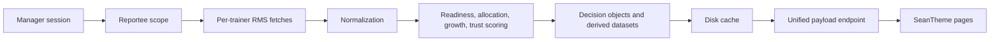

# SkillEdge / SkillNex Manager Engineering Retrospective

This retrospective is based on the current repository state and the project documentation history. Where documents and code differ, the live code and active runtime structure take precedence.

## Executive Summary

SkillEdge has evolved from a notebook-driven trainer analysis prototype into a manager-scoped delivery intelligence system with a server-side unified payload, explainable scoring, decision objects, and a SeanTheme-based frontend.

The core strategic shift was simple but profound:

- from browser-side aggregation and API fan-out
- to server-side orchestration, caching, and a single manager intelligence endpoint

That shift unlocked a more trustworthy product shape:

- manager identity is enforced server-side
- reportee scope is resolved in the backend
- trainer readiness, allocation, growth, and risk are derived once
- pages render slices of the same unified payload

The project is now materially stronger than the original dashboard concept. It is not just a reporting surface. It is an opinionated decision system for allocation, growth, coaching, certification, and trust.

## Project Origin

The early product intent was a trainer intelligence notebook translated into a web portal. The original ambition was to answer manager questions like:

- who can deliver now
- who needs prep
- who should be stretched
- who should not be risked
- what should happen next

The oldest docs frame this as a manager dashboard or delivery intelligence cockpit. Over time, that framing matured into a broader Manager OS concept: a scoped operating layer for training managers and delivery leaders.

The original architecture was conceptually:

- a set of RMS APIs
- some notebook logic
- a browser UI that could display the outputs

The current architecture is a much cleaner version of that idea:

- `server.py` as the entry point
- `backend/app.py` as the HTTP runtime
- a unified endpoint at `/data/unified-manager-intelligence`
- one cached payload per manager
- HTML pages that consume the same backend truth

## Architecture Journey

### Phase 1: Notebook-to-portal translation

The first phase was about proving that trainer intelligence could be synthesized from fragmented RMS data.

The early objectives, reflected throughout the docs, were:

- certification mapping
- skill gap detection
- readiness scoring
- allocation support
- feedback and HR risk
- custom course matching
- manager actions

At this stage, the product was still trying to prove that the data could support meaningful decisions.

### Phase 2: Browser-heavy dashboard phase

The next step was a SeanTheme dashboard and multiple auxiliary pages.

This phase added a lot of surface area:

- dashboard
- team
- trainer 360
- allocation desk
- custom course match
- actions
- data health
- capability builder
- risk-takers

But the architecture was still noisy. Several docs describe a period where the browser had too much responsibility, including duplicated fetching and duplicated normalization logic.

That created the first major lesson of the project:

- intelligence belongs in the backend
- the browser should visualize, not compute

### Phase 3: Backend consolidation

The repo now clearly shows the consolidation outcome.

The current backend is organized around:

- `backend/intelligence.py`
- `backend/services/trainer_fetch_service.py`
- `backend/services/decision_objects.py`
- `backend/services/allocation_decision_service.py`
- `backend/services/manager_action_service.py`
- `backend/services/custom_course_match_service.py`
- `backend/shared/*`
- `backend/intelligence_engines/*`

The unified flow is:

1. resolve manager session
2. fetch reportees
3. fetch per-trainer RMS signals
4. normalize responses
5. score trainer readiness and risk
6. derive allocation, delivery, growth, certification, and organization intelligence
7. emit one unified JSON payload
8. cache it on disk
9. serve it to all pages

That is now the real system.

## What the Project Built, Chronologically

### 1. Original manager cockpit

The original dashboard idea was a broad command center for daily decisions.

What it tried to do:

- show who reports to me
- show who is ready
- show who needs coaching
- show what needs attention

What it lacked:

- server-side authentication
- a unified contract
- robust error isolation
- consistent decision semantics

### 2. Readiness and allocation intelligence

The next major milestone was the introduction of readiness scoring and allocation logic.

This is the backbone of the product and still one of the strongest parts of the codebase.

What existed before:

- raw trainer signals
- fragmented APIs
- no consistent decision vocabulary

What changed:

- weighted readiness scoring
- availability labeling
- course allocation scoring
- manager action generation
- explainable evidence fields

Backend impact:

- trainer fetches became structured
- per-trainer failures were isolated
- scores were normalized
- confidence and missing signals became first-class

Frontend impact:

- dashboard, team, trainer detail, and allocation views could all show the same truth

User impact:

- managers could trust the system more because every score had a reason

### 3. SeanTheme migration

SeanTheme was adopted as the UI language, but not as a cosmetic layer only.

It informed the interaction model for:

- dashboard cockpit
- email inbox-style actions
- card-based trainer 360
- allocation desk
- data health views

This mattered because the UI was no longer generic. It was built to support decision workflows, not just tables.

### 4. Unified endpoint architecture

This is the biggest architectural milestone in the repo.

The current runtime exposes one manager-scoped endpoint:

`GET /data/unified-manager-intelligence`

That endpoint now powers the pages and is cached per manager.

What it replaced:

- browser-side RMS fan-out
- duplicated client-side data pipelines
- multiple conflicting scoring systems

Why it was important:

- one source of truth
- fewer API calls
- consistent manager scope
- easier testing
- easier page composition

### 5. Decision objects

Decision objects are a major evolution. They lift the project from “datasets” to “manager decisions with traceability.”

The contract now includes:

- `decision_contract_version`
- `id`
- `entity_type`
- `trainer_email`
- `trainer_name`
- `score`
- `confidence`
- `blockers`
- `evidence`
- `recommended_action`
- source dataset trace fields

The repo currently builds decision objects for:

- trainer decisions
- allocation decisions
- manager actions
- custom course matches

What they replaced:

- ad hoc rendering of raw rows
- page-specific inference logic
- inconsistent action summaries

Why they matter:

- they create a stable bridge between backend intelligence and frontend UX
- they support auditability
- they let multiple pages interpret the same decision in consistent ways

### 6. Growth and OEM intelligence

Later work added a more strategic layer:

- vendor strength
- growth recommendations
- OEM capability heatmap
- future skill roadmap
- future certification roadmap
- executive risk and investment items

This is where the product moved beyond “who can deliver” into “who should grow into what next.”

That is an important product maturity jump.

### 7. Custom course intelligence

Custom course matching started as a frontend heuristic and matured into a backend-scored service.

What existed before:

- paste-outline parsing in the browser
- heuristic skill overlap
- user-visible ranking

What changed:

- backend course outline parsing
- decision-object output
- course metadata extraction
- adjacent skill reasoning
- risk and readiness combination

The current system still supports browser-side fallback behavior, but the backend is now the preferred source of truth.

## Current Architecture

### Backend

The backend is now layered and much closer to an enterprise design.

Key responsibilities:

- session/auth management
- RMS relay
- reportee scope resolution
- trainer fetch orchestration
- normalization
- scoring
- recommendation synthesis
- decision object generation
- cache read/write
- static serving

### Unified payload

The canonical datasets in the current payload are:

- `trainer_operations_df`
- `course_allocation_df`
- `trainer_timeline_df`
- `manager_action_df`
- `trainer_availability_engine_df`
- `custom_course_match_df`
- `data_health_df`

The payload also includes derived intelligence layers such as:

- `vendor_strength_df`
- `growth_intelligence_df`
- `oem_capability_heatmap_df`
- `certification_intelligence_df`
- `delivery_intelligence_df`
- `allocation_intelligence_df`
- `course_best_trainer_df`
- `allocation_risk_df`
- `allocation_ranked_trainer_df`
- `feedback_coaching_df`
- `future_skill_roadmap_df`
- `future_certification_roadmap_df`
- organization and executive intelligence datasets
- decision object collections

### Data flow

### Fallback logic

The system is careful about uncertainty:

- missing signals lower confidence
- availability remains conservative when schedule evidence is weak
- data-health rows surface gaps instead of hiding them
- stale cache can be used if rebuild fails

That honesty is one of the strongest qualities in the repo.

## Page-by-Page Review

### Dashboard

Purpose:

- morning cockpit
- executive summary
- allocation snapshot
- action inbox
- OEM and succession health
- data trust summary

Current maturity:

- highest maturity page in the product
- strong composition of decision surfaces
- good use of decision objects and summary datasets

Design quality:

- mature
- dense, but purposeful
- clearly oriented toward action

Backend maturity:

- strong
- built off the unified payload
- mostly decision-driven

Known gaps:

- still inherits any backend confidence issues
- some legacy navigation links remain

### My Team

Purpose:

- compact operational matrix for the scoped team
- filters by readiness, availability, directness, risk

Current maturity:

- strong and practical

Design quality:

- good
- efficient
- clear scanability

Backend maturity:

- good
- consumes trainer operations and availability intelligence well

Known gaps:

- some legacy rows and hidden columns still suggest earlier design compromises

### Trainer 360

Purpose:

- deep dive on one trainer
- readiness, capability, certification, delivery, growth, risk, evidence

Current maturity:

- very strong
- one of the best-designed surfaces in the product

Design quality:

- excellent
- compact but rich
- uses multiple rails well

Backend maturity:

- strong
- decision-object aware
- links to delivery, allocation, growth, and future roadmap intelligence

Known gaps:

- still reflects the uncertainty of upstream APIs
- some fields are explicitly not available and must remain so

### Allocation Desk

Purpose:

- course-first matching
- best trainer
- backups
- risk and trade-offs

Current maturity:

- strong
- very close to a true operational allocation tool

Design quality:

- good
- dense, but readable
- appropriate for a decision desk

Backend maturity:

- strong
- closely tied to allocation decision objects

Known gaps:

- domain and technology tags are still incomplete
- some course intelligence remains partial

### Custom Course Match

Purpose:

- rank trainers for a custom syllabus or outline

Current maturity:

- promising
- more advanced than a simple demo page

Design quality:

- good
- more expressive than the older pages

Backend maturity:

- improving
- backend scoring exists, but upload parsing remains weaker than paste-based flow

Known gaps:

- upload parsing is still pending
- some logic still falls back to browser heuristics

### Action Center

Purpose:

- manager inbox of recommended actions
- coaching
- allocation
- certification
- data-related tasks

Current maturity:

- strong
- excellent workflow framing

Design quality:

- familiar, inbox-like, and manager-friendly

Backend maturity:

- good
- uses manager action objects when present

Known gaps:

- action persistence is not a full workflow engine
- there is no true task lifecycle

### Data Health

Purpose:

- explain what is incomplete, missing, stale, or uncertain

Current maturity:

- very strong as a trust surface

Design quality:

- clear
- honest
- grounded in actual issue rows

Backend maturity:

- strong
- health normalization is one of the repo’s better engineering decisions

Known gaps:

- still depends on upstream API quality
- only as good as the source data

### Capability Builder

Purpose:

- growth candidates
- upskill paths
- certification attention
- future direction

Current maturity:

- useful, but more transitional than final

Design quality:

- good
- clearly aimed at manager development actions

Backend maturity:

- moderate to strong
- relies on growth intelligence and allocation signals

Known gaps:

- some of the same intelligence is also visible in Trainer 360 and Growth pages
- risk of overlap remains

### Growth & Risk

Purpose:

- safe experts
- growth candidates
- risk-takers
- do-not-risk trainers
- succession and executive risks

Current maturity:

- strong
- this page is a meaningful synthesis layer

Design quality:

- good
- structured around decision categories

Backend maturity:

- strong
- ties together growth, risk, and executive intelligence

Known gaps:

- can overlap with parts of Capability Builder and Trainer 360

### Trainer Intelligence

Purpose:

- a more advanced trainer command cockpit

Current maturity:

- very strong but also more experimental and dense than the main pages

Design quality:

- sophisticated
- highly information-dense

Backend maturity:

- strong
- deeply connected to the unified payload and decision objects

Known gaps:

- complexity is high
- this page is powerful, but harder to onboard to quickly

## Decision Object Journey

Decision objects were introduced to solve a structural product problem:

- pages were interpreting raw datasets differently
- the same trainer could look slightly different in different views
- the product needed a shared language for “why”

The current contract gives us:

- stable IDs
- buckets/status
- blockers
- confidence
- evidence
- source traceability

Current usage:

- trainer decision objects
- allocation decision objects
- manager action objects
- custom course match objects

Migration status:

- mature in backend
- partially reflected across pages
- still some legacy dataframe-based fallbacks in the UI

Remaining work:

- simplify all pages to prefer decision objects where possible
- reduce fallback branching where the decision object already exists

## Testing Journey

Testing has clearly improved over time.

### Smoke tests

The main smoke test verifies:

- imports
- required page existence
- no direct RMS/proxy calls in HTML
- health endpoint
- login
- authenticated unified endpoint
- payload contract
- cached second call behavior

This is a strong baseline.

### Contract tests

There is also a dedicated decision object contract test covering:

- trainer decision objects
- allocation decision objects
- manager action objects
- custom course match objects

That is a big step forward because it protects the product’s decision spine.

### Browser QA

The active pages are now structured to be validated in-browser against the unified payload.

### Runtime validation

Runtime validation exists in the form of:

- session auth
- scoped payload access
- health endpoint
- stale cache fallback

What improved over time:

- fewer silent failures
- better payload validation
- better separation between source data and page rendering

## SeanTheme Journey

The UI evolved from generic dashboard usage to a more deliberate SeanTheme language.

What inspired what:

- inbox patterns influenced actions
- order detail patterns influenced Trainer 360
- customer order / selection patterns influenced Allocation Desk
- data management patterns influenced Data Health
- timeline and card patterns shaped capability and growth views

What got adopted:

- Bootstrap Icons
- ApexCharts
- card-based dashboards
- inbox/list hybrid surfaces
- evidence tables behind collapsible or secondary views

What still needs improvement:

- some pages are very dense
- the design language is good, but a few pages are still more functional than polished
- consistency between pages could still be tightened

## Current Maturity Assessment

This is the honest read on the current system.

| Dimension | Assessment |
|---|---|
| Architecture | 8.5/10 |
| Backend | 8.5/10 |
| Frontend | 7.5/10 |
| Manager experience | 8/10 |
| Maintainability | 7.5/10 |
| Testing | 7.5/10 |
| Performance | 7/10 |
| Extensibility | 8/10 |

The strongest areas are:

- backend orchestration
- decision objects
- trust surfaces
- manager-oriented pages
- derived intelligence layers

The weakest areas are:

- legacy overlap between pages
- remaining heuristic fallback logic
- some complexity in the browser
- incomplete upstream APIs for certain capabilities

## What Was Built

### Pages

Active pages in the current surface include:

- Dashboard
- My Team
- Trainer 360
- Allocation Desk
- Custom Course Match
- Action Center
- Data Health
- Capability Builder
- Growth & Risk
- Trainer Intelligence
- Settings

There are also deprecated redirect pages that preserve older URLs.

### Backend services

Important backend components now include:

- session/auth service
- RMS relay service
- static serving
- cache service
- trainer fetch orchestration
- custom course matching service
- decision object service
- allocation decision service
- manager action service

### Intelligence services

The backend derives:

- readiness
- availability
- delivery intelligence
- allocation intelligence
- growth intelligence
- certification intelligence
- organization intelligence
- executive intelligence
- future skill roadmap
- future certification roadmap

### Shared components

The shared layer covers:

- scoring
- normalizers
- explainability
- safety/redaction
- constants
- growth/intelligence helpers
- delivery/intelligence helpers
- allocation/intelligence helpers
- certification/intelligence helpers
- executive/intelligence helpers
- organization/intelligence helpers
- manager recommendation intelligence

### Tests

The current test coverage includes:

- smoke tests
- decision object contract tests

### Documentation

The docs now include:

- product constitution
- product strategy
- current reality maps
- architecture specs
- design maps
- deployment notes
- API verification notes
- production status
- retrospective planning docs

That documentation history is valuable, but some of it is explicitly historical and should not be treated as current truth without cross-checking the code.

## Timeline

### Phase 1

- notebook prototype
- raw RM S API experimentation
- trainer intelligence concept formation

### Phase 2

- dashboard and SeanTheme surfaces
- manager cockpit framing
- page proliferation to support multiple workflows

### Phase 3

- backend normalization and scoring
- readiness, availability, allocation, and health engineering
- reportee-scoped unified payload

### Phase 4

- decision objects
- growth intelligence
- OEM / vendor strength
- executive and organization intelligence

### Phase 5

- custom course backend scoring
- stronger test coverage
- more stable manager OS architecture
- deprecation and compatibility cleanup

### Phase 6

- current state: a functional manager OS with a strong backend spine and a maturing frontend surface

## Lessons Learned

### Good decisions

- server-side manager scoping
- unified payload architecture
- cached per-manager intelligence
- explainable scoring
- decision objects
- surface-level honesty about missing signals
- keeping the browser as a consumer, not a source of truth

### Bad decisions

- letting the browser own too much intelligence early on
- carrying overlapping pages for too long
- allowing fallback heuristics to remain visible longer than ideal

### Technical debt removed

- direct browser RMS fan-out
- duplicate client-side intelligence paths
- insecure session assumptions
- unclear page/source separation

### Technical debt remaining

- page overlap
- incomplete upstream APIs
- some browser-side fallback logic
- a few transitional views that should eventually collapse into clearer workflows

### Things that should never change

- manager-scoped backend truth
- unified endpoint contract
- explainable confidence and evidence
- trust surfaces for missing data
- server-side auth and scope enforcement

### Things that should be redesigned

- duplicated or overlapping pages
- any remaining UI logic that re-derives backend truth
- complex fallback paths where a single decision object is enough

## Recommendations

### High priority

1. Keep collapsing legacy fallback paths into the unified backend truth.
2. Reduce overlap between Capability Builder, Growth & Risk, and Trainer 360.
3. Continue tightening the decision-object-first rendering model.
4. Keep improving the backend contract tests and smoke tests.

### Medium priority

1. Improve page consistency and reduce visual density where it hurts scanning.
2. Keep refining custom course parsing and backend course matching.
3. Add more stable coverage for the remaining partially verified APIs.
4. Improve the future-skill and certification roadmap surfaces.

### Low priority

1. Cosmetic polishing of already-strong pages.
2. Small layout refinements in secondary views.
3. Extra navigational conveniences once the core workflow is stable.

### Immediate wins

1. Prefer decision objects everywhere they already exist.
2. Keep the trust layer prominent.
3. Use the codebase’s own contract tests as the source of truth for future refactors.

### Long-term architecture

The long-term direction is already visible in the code:

- a manager operating system
- grounded in live RMS data
- with explainable intelligence
- with trust and evidence built in
- and eventually ready for deeper knowledge-graph and copilot layers

## Final Assessment

SkillEdge is no longer just a dashboard. It is now a real manager decision platform with a credible architecture, strong backend intelligence, and a clear product identity.

The strongest thing about the project is not any single page. It is the backbone:

- scoped manager truth
- normalized trainer intelligence
- explainable decisions
- cached unified payloads
- trust surfaced honestly

The main remaining challenge is not invention. It is consolidation:

- reduce overlap
- simplify the remaining fallbacks
- keep hardening the contract

If the team stays disciplined about that, this can become a very strong enterprise product.
